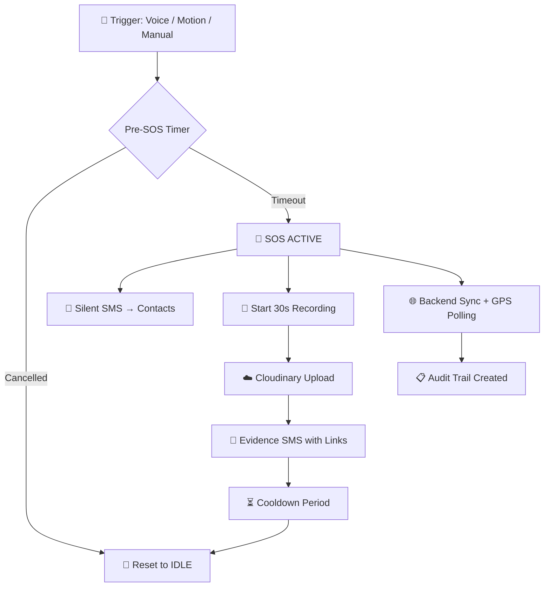

<div align="center">

# Aegis

**A covert, AI-powered women's safety system disguised as a fully functional calculator.**

[](https://github.com/saransh-rana-08/CodeNakshatra-Ageis/releases/latest)
[](https://expo.dev)
[](https://www.typescriptlang.org/)
[](https://groq.com)
[](./LICENSE)

[**Download APK**](https://github.com/saransh-rana-08/CodeNakshatra-Ageis/releases/latest) · [**User Guide**](./Guide.md) · [**Architecture**](./Brain.md)

</div>

---

## The Problem Aegis Solves

> *"How can a victim trigger SOS when they cannot safely use their phone?"*

A visible "panic button" app fails the moment an attacker sees it. Standard emergency flows — unlock, find app, open, tap — take seconds a victim may not have. Aegis is built around a different assumption: **the phone may be visible to the attacker, physical interaction may be impossible, and time is measured in heartbeats.**

---

## Why Aegis Is Different

Most safety apps are built for *after* danger is recognized. Aegis is built for the moment *danger is present* — when you cannot safely look at or touch your phone.

| Feature | Typical Safety App | Aegis |
|---|---|---|
| **Disguise** | Labeled "SOS" or "Emergency" | Fully functional Calculator |
| **Activation** | Requires unlocking & tapping | Voice, motion, or hidden PIN |
| **SMS Delivery** | Routes through internet backend | Direct Android SIM subsystem |
| **Trigger Methods** | Manual only | Manual + Voice (AI) + Motion |
| **Evidence** | Alert only | Audio + Video + Live GPS |
| **Hands-Free** | No | Yes |
| **Works offline** | No | Yes (SMS fallback) |

---

## Core Features

### Calculator Disguise (Stealth UI)
The app opens as a **fully functional calculator** — arithmetic works, nothing looks suspicious. Only you know the secret: enter your custom PIN and press `=` to unlock the real safety system. No "Emergency" labels. No SOS branding. No discoverability.

### AI Voice SOS — Groq Whisper Large v3
Aegis runs a continuous background audio loop, transcribing 3-second chunks using [Whisper-large-v3](https://groq.com). It understands **English, Hindi, and Hinglish** — keywords like *"Help"*, *"Bachao"*, *"Leave me"*, or *"Save me"* trigger the SOS sequence without you touching your phone.

### Native Silent SMS (Zero-Tap Dispatch)
A custom Kotlin module (`expo-silent-sms`) sends alerts **directly through the Android SIM subsystem**, bypassing both the standard SMS UI and the internet. Emergency contacts receive your location immediately — even if Aegis's cloud backend is unreachable.

### Evidence Capture & Cloud Sync
On SOS activation, Aegis simultaneously records 30 seconds of audio and video, uploads directly to Cloudinary, and sends a final evidence SMS with media links and a live Google Maps URL to every emergency contact.

### Fail-Safe Architecture
- SOS dispatch is **never** blocked by non-critical failures (backend down, upload failed, GPS slow)
- A pre-SOS alarm + cancellation window prevents false triggers
- Automated triggers are rate-limited; manual SOS bypasses all restrictions
- OEM-specific hardening for Xiaomi, Oppo, and Vivo battery killers

---

## SOS Lifecycle



---

## Architecture

### Tech Stack

| Layer | Technology |
|---|---|
| **Framework** | React Native — Expo SDK 54 |
| **Language** | TypeScript |
| **Navigation** | Expo Router (file-based) |
| **State** | Custom hooks + AsyncStorage |
| **Animation** | Moti + Reanimated |
| **AI Transcription** | Groq Whisper-large-v3 |
| **Native SMS** | Custom Kotlin `expo-silent-sms` module |
| **Media Storage** | Cloudinary (direct integration) |
| **SMS Fallback** | Twilio HTTP API |
| **Networking** | Axios |
| **Auth** | JWT |
| **Build System** | EAS Build |

### Project Structure

```
├── app/                    # Navigation & screens (auth, tabs, features)
│   └── features/
│       ├── voiceSOS/       # AI voice detection & transcription
│       └── videoSOS/       # Evidence capture logic
│
├── hooks/home/             # Core runtime hooks
│   ├── useSOSOrchestrator  # Central SOS state machine
│   ├── useMotionDetection  # Accelerometer-based trigger
│   ├── useLocationTracker  # GPS + polling
│   ├── useVoiceSOS         # Audio loop + Groq integration
│   └── useSOSRestriction   # Cooldown & rate limiting
│
├── modules/
│   └── expo-silent-sms/    # Native Android SMS bridge (Kotlin)
│
├── services/               # API clients (SMS, SOS backend, Cloudinary)
└── constants/              # Config, themes, safety rules
```

### Runtime State Machine

```
IDLE → LISTENING → TRIGGER_DETECTED → PRE_SOS → SOS_ACTIVE
     → RECORDING → UPLOADING → EVIDENCE_READY → DISPATCHED → COOLDOWN → IDLE
```

---

## Quick Start

### Prerequisites

- Node.js ≥ 18 & npm
- EAS CLI: `npm i -g eas-cli`
- A physical Android device (native features require real hardware)
- [Groq API Key](https://console.groq.com/keys)

### Installation

```bash
git clone https://github.com/saransh-rana-08/CodeNakshatra-Ageis.git
cd CodeNakshatra-Ageis
npm install
```

### Environment Setup

Create a `.env` file in the project root:

```env
EXPO_PUBLIC_GROQ_API_KEY=your_groq_key_here
```

### Build & Run

```bash
# Development build (for physical device testing)
eas build --platform android --profile development

# Production APK
eas build --platform android --profile production
```

>**Note:** Expo Go is not supported. Features like Silent SMS, background voice detection, and motion sensors require a native EAS build on a real Android device.

---

## Security & Privacy

| Concern | Current Approach | Recommended Hardening |
|---|---|---|
| Groq API Key | Injected at build-time | Proxy via backend |
| Calculator PIN | AsyncStorage | Android Keystore / SecureStore |
| Cloudinary Config | Environment variable | Server-side proxy |
| Emergency Contacts | Local AsyncStorage | Encrypted local store |

> See [Brain.md — Section 18](./Brain.md#18-security-model) for the full security model and known risks.

- Camera and microphone are **only active** during listening and SOS phases
- Emergency contact data never leaves the device except during active SOS
- No ads, no analytics, no data brokering

---

## Known Limitations

- **App killed by user** → SOS session ends immediately (no background recovery)
- **Doze mode** → Voice detection suspended; motion and SMS partially functional
- **OEM kill behavior** (Xiaomi, Oppo, Vivo) → Requires manual AutoStart permission
- **Native SMS ≠ guaranteed delivery** → SIM carrier accepts the request; delivery confirmation is not available
- **No session replay** → Mid-SOS restart does not resume the active sequence

See [Brain.md — Section 17](./Brain.md#17-known-unsafe-zones) for the full list of known unsafe zones.

---

<div align="center">

*Built for the moments when you need help but cannot ask for it.*

</div>